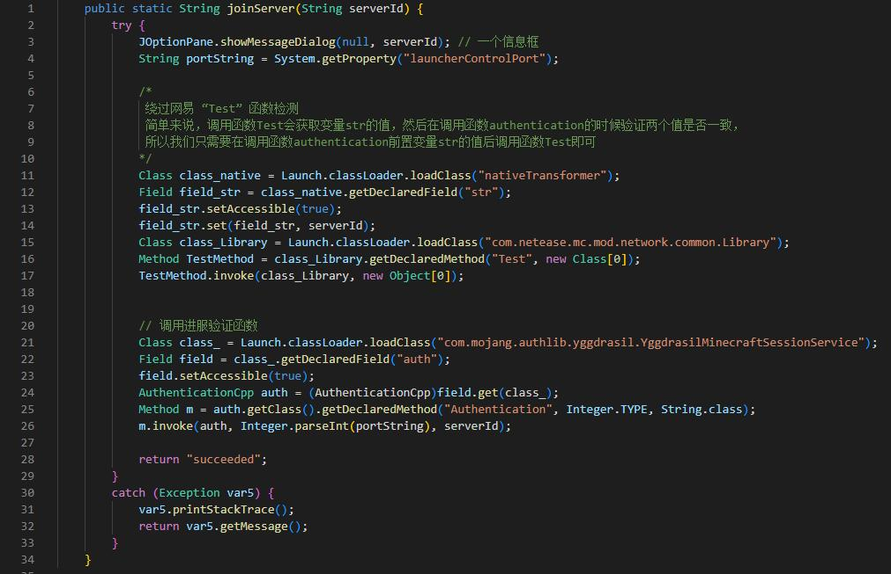

# XiaoZhi ClientLauncher (XZCL Project)

XiaoZhi ClientLauncher Version 5

### 告知
该项目已经失效

## 在此致敬 ClientLauncher 作者 Ho3
注：本项目由小智（XiaoZhi）负责开发、运营和维护，与Ho3大神的ClientLauncher无任何联系！

### 说明：
本项目是继Ho3大神的ClientLauncher (CL) 以后的新一代网易《我的世界》开端核心模块，绕过网易最新的检测；本项目原先为小智个人使用，后使用于小智旗下的项目（如Switch Project、Xenon Launcher Project 等）经过长达三个月的测试后，决定发出。
如果使用本项目，请遵守以下几点：

1. 请勿修改文件内的任何字符串
2. 本项目内所有文件均无混淆、保护处理，请尊重作者
3. 本项目均无改动进程标题等营销内容，这是对大家的尊重
### 项目包含：
- DLL 版本
- Forge-Mod 版本
### 注意事项：
1. 使用本项目请调整你的内存防封，请不要动网易任何有关函数Init、函数Test的基址，如"yv*****"、"nativeTra****"等
2. 使用Forge-Mod 版本需要绕过网易client_pcyc_check
3. 请使用各个版本特有的authlib

## 核心代码：

